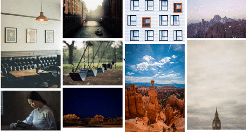

# Homework 9 - Plugin Playground

Play around with Plugins!

Non-touch devices:

Touch devices:

### Step 1 - Fork this repository.

From the assignment homepage (https://github.com/fewd05082017/week9), click the "Fork" link on the top right. This will create a copy of the assignment in YOUR github account.

### Step 2 - Clone your forked repository.

From the repository homepage (which will be http://github.com/YOURUSERNAME/week9), click on green "Clone or Download" button and "Open in Desktop". This should open your Github Desktop App and prompt you to save the week9 folder on your computer.

### Step 3 - Build!

Choose a lightbox plugin, add a lightbox effect to the page that opens the full size image (in img/fullsize) on click.

Disable the hover effect for devices with touchevents (in css).

Only for devices with touch events, when the user presses on a thumbnail, show the caption by adding the class "open" to the thumbnail that fired the event. 

Only for devices with touch events, when the user swipes on a thumbnail, hide the caption by removing the class "open" on the thumbnail that fired the event. Optionally, add an animation to the left position to animate the "swipe" effect.

**Be creative!** "Bonus points" for: added features, additional styles, additional pages. 

### Step 4 - Commit and Sync

Work on your website locally and view it in the browser by opening your index.html file. When your site looks good, Commit and Sync with the Github App.

### Step 5 - Pull Request

Send a Pull Request to submit your homework. From your week9 page on github.com (https://github.com/YOURUSERNAME/week9), click on the "New Pull Request" button and follow the prompts. 

### Step 6 - Publish with [Gitbot](http://gitbot.co/)! (optional)

Want to post your week9 project on your github.io url? Log into gitbot and click the week9 repository button and VOILA! It will (perhaps after a few minutes) be viewable online at http://YOURUSERNAME.github.io/week9

